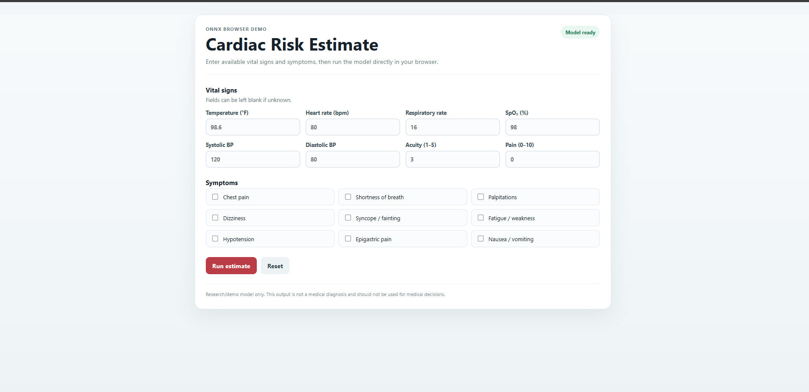

<div align="center">

# 🫀 Cardiac Risk Dashboard

### Browser-Based Cardiovascular Risk Screening with ONNX Runtime Web

A lightweight machine-learning dashboard that estimates cardiovascular risk directly in the browser using patient vital signs and reported symptoms.

**No backend. No database. No Python server.**

<br>


<br>

### 🌐 [Live Demo]([https://YOUR_USERNAME.github.io/cardiac-risk-dashboard/](https://mr-amirasgari.github.io/cardiac-risk-dashboard/))

</div>

---

## Overview

**Cardiac Risk Dashboard** is a client-side machine-learning application designed to demonstrate cardiovascular risk screening from routinely available triage information.

The application collects vital signs and symptom indicators, performs feature preprocessing in JavaScript, runs an exported machine-learning model through **ONNX Runtime Web**, and displays an estimated cardiovascular risk probability.

All inference happens locally inside the browser.

```text
Patient Inputs
      ↓
Feature Engineering
      ↓
ONNX Runtime Web
      ↓
Logistic Regression
      ↓
Probability Calibration
      ↓
Risk Estimate
```

---

## Dashboard Preview

<p align="center">
  
</p>

> Add a screenshot of the deployed dashboard as `assets/dashboard-preview.png`.

---

## Features

- Fully browser-based inference
- No backend API required
- No database required
- ONNX machine-learning model
- Probability calibration
- Cardiovascular risk estimation
- Missing-value handling
- Symptom-based feature engineering
- Responsive web interface
- Compatible with GitHub Pages
- Runs entirely on the client side

---

## Input Variables

### Vital Signs

| Input | Description |
|---|---|
| Heart Rate | Beats per minute |
| SpO₂ | Peripheral oxygen saturation |
| Systolic BP | Systolic blood pressure |
| Diastolic BP | Diastolic blood pressure |
| Respiratory Rate | Breaths per minute |
| Temperature | Body temperature |
| Pain Score | Pain severity from 0–10 |
| Acuity | Triage acuity level |

### Symptoms

The interface also includes the following symptom indicators:

- Chest pain
- Shortness of breath / dyspnea
- Palpitations
- Dizziness
- Syncope
- Fatigue / weakness
- Hypotension
- Epigastric pain
- Nausea / vomiting

---

## Machine Learning Pipeline

The current deployment uses a **Logistic Regression** model.

```text
Raw Inputs
    ↓
Missing-Value Indicators
    ↓
Median Imputation
    ↓
Standard Scaling
    ↓
Logistic Regression
    ↓
Platt Calibration
    ↓
Calibrated Probability
```

The deployed model receives **26 engineered features**.

---

## Model Performance

The current prototype was evaluated using patient-level cross-validation on the **MIMIC-IV-ED Demo v2.2** dataset.

| Metric | Result |
|---|---:|
| ROC-AUC | **0.7838** |
| PR-AUC | **0.2106** |
| Raw Brier Score | **0.1308** |
| Calibrated Brier Score | **0.0538** |

Probability calibration substantially reduced the Brier score in the demo evaluation.

### Demo Thresholds

| Strategy | Threshold |
|---|---:|
| Maximum F1 | 0.143 |
| Youden J | 0.091 |
| Screening-oriented | 0.026 |

These thresholds were derived only from the small demo dataset and should **not** be interpreted as clinically validated decision thresholds.

---

## Dataset

The development pipeline currently uses:

### MIMIC-IV-ED Demo v2.2

MIMIC-IV-ED contains emergency department information including:

- Triage vital signs
- Chief complaints
- Emergency department stays
- Diagnosis information
- Repeated vital-sign measurements

The public demo dataset was used to build and validate the end-to-end software pipeline.

The workflow included:

```text
Data Understanding
       ↓
Exploratory Data Analysis
       ↓
Data Cleaning
       ↓
Cardiac Target Definition
       ↓
Feature Engineering
       ↓
Patient-Level Cross Validation
       ↓
Model Comparison
       ↓
Calibration
       ↓
Explainability
       ↓
Uncertainty Analysis
       ↓
ONNX Export
```

---

## Model Development

Several models were evaluated during development:

| Model | Role |
|---|---|
| Logistic Regression | Primary deployment candidate |
| Random Forest | Secondary candidate |
| XGBoost | Comparative model |

The final demo deployment uses Logistic Regression because of its combination of discrimination performance, interpretability, and compatibility with lightweight browser deployment.

---

## Explainability

Feature analysis was performed using:

- Standardized logistic regression coefficients
- Cross-validated permutation importance
- SHAP
- Bootstrap prediction uncertainty

Among the strongest signals observed in the demo analysis were:

```text
Dyspnea
Heart Rate
```

Because the current dataset is intentionally small, these findings should be treated as exploratory rather than clinical conclusions.

---

## Uncertainty Analysis

Patient-level bootstrap resampling was used to study prediction stability.

The analysis showed that some predictions remain highly sensitive to training-sample variation.

This provides a basis for future versions of the dashboard to report both:

```text
Risk Probability
+
Prediction Uncertainty
```

rather than presenting a single probability without context.

---

## Browser Inference

The trained Scikit-learn pipeline was exported to:

```text
cardiac_model.onnx
```

The browser loads the model with **ONNX Runtime Web**.

```javascript
const session = await ort.InferenceSession.create(
  "./models/cardiac_model.onnx"
);
```

Inference therefore happens directly on the user's device.

### Advantages

- No patient information is sent to a prediction server
- No backend infrastructure
- Simple static deployment
- Low hosting cost
- Compatible with GitHub Pages

---

## Project Structure

```text
cardiac-risk-dashboard/
│
├── index.html
├── style.css
├── app.js
│
├── models/
│   ├── cardiac_model.onnx
│   ├── model_metadata.json
│   └── feature_names.json
│
├── assets/
│   └── dashboard-preview.png
│
└── README.md
```

---

## Run Locally

Clone the repository:

```bash
git clone https://github.com/YOUR_USERNAME/cardiac-risk-dashboard.git
```

Enter the project:

```bash
cd cardiac-risk-dashboard
```

Start a local static server:

```bash
python -m http.server 8000
```

Then open:

```text
http://localhost:8000
```

---

## Deploy with GitHub Pages

Push the project to GitHub and open:

```text
Repository
→ Settings
→ Pages
```

Select:

```text
Source: Deploy from a branch
Branch: main
Folder: / (root)
```

After deployment, the application will be available at:

```text
https://YOUR_USERNAME.github.io/cardiac-risk-dashboard/
```

---

## Technology Stack

| Component | Technology |
|---|---|
| Interface | HTML5 |
| Styling | CSS3 |
| Application Logic | Vanilla JavaScript |
| ML Development | Python / Scikit-learn |
| Model Format | ONNX |
| Browser Inference | ONNX Runtime Web |
| Dataset | MIMIC-IV-ED Demo |
| Hosting | GitHub Pages |

---

## Limitations

The current implementation is intentionally a lightweight prototype.

Major limitations include:

- Training data is limited to the MIMIC-IV-ED Demo dataset
- Very small number of positive cardiac cases
- No external validation
- No prospective clinical validation
- Thresholds are experimental
- Predictions should not be treated as medical diagnoses

A production or research-grade version should be retrained and evaluated on substantially larger datasets.

---

## Future Improvements

Potential extensions include:

- Full MIMIC-IV-ED training
- External validation
- Dynamic vital-sign monitoring
- Improved uncertainty estimation
- Additional cardiovascular outcomes
- Temporal prediction models
- More advanced symptom NLP
- Interactive model explanations
- Improved mobile interface
- Additional calibration methods

---

## Disclaimer

> **This project is intended solely for software demonstration, educational, and research purposes.**

The application is **not a medical device** and has not been clinically validated.

Predictions generated by this application must not be used for medical diagnosis, treatment decisions, emergency triage, or as a replacement for professional healthcare evaluation.

---

## Data Usage

MIMIC data is provided through **PhysioNet**.

Any use of MIMIC-derived datasets must comply with the applicable PhysioNet credentialing requirements, licenses, and data-use agreements.

---

<div align="center">

### Cardiac Risk Dashboard

**HTML • CSS • JavaScript • ONNX Runtime Web**

Built as a lightweight demonstration of in-browser machine-learning inference.

</div>
